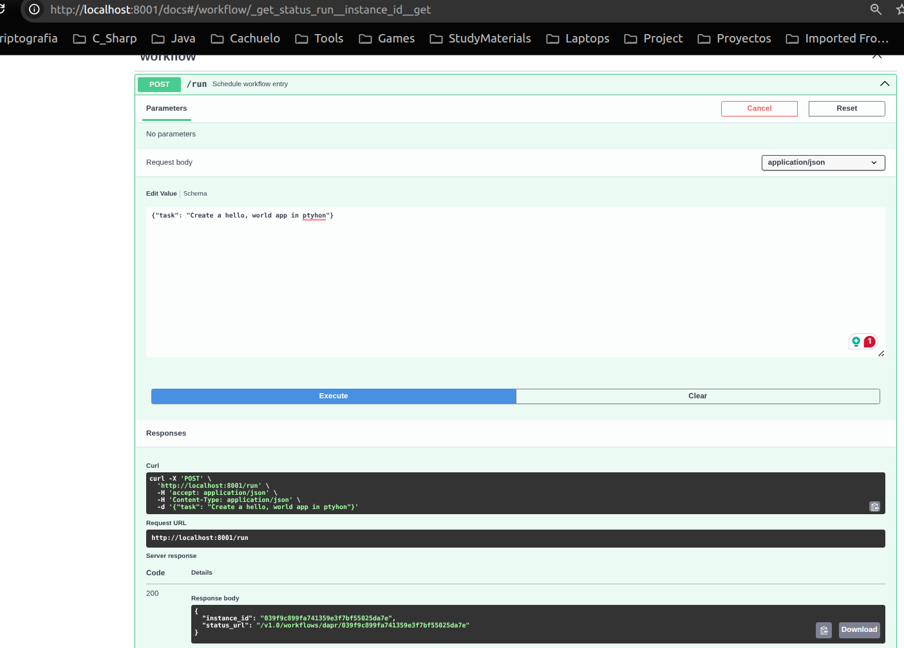
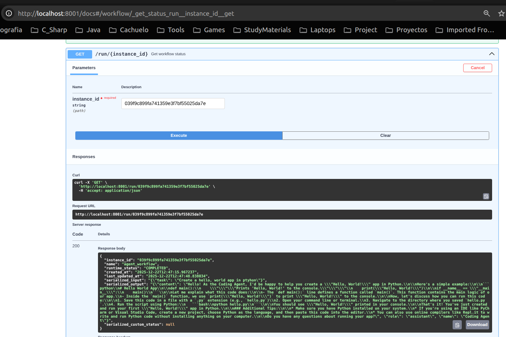

# Dapr Agents coding agent assignment

Your task is to make a coding agent using the starter provided in this repository.
The expectation is to use 2-4 hours. It should not be necessary to spend >4 hours.

## Resource
- [Dapr Agents docs](https://v1-16.docs.dapr.io/developing-applications/dapr-agents/)
- [Dapr Python SDK docs](https://docs.dapr.io/developing-applications/sdks/python)

## Pre-requisites

This starter assumes you are running the following:
- [Ollama](https://ollama.com/download) on port 11434 with [llama3.2:latest](https://ollama.com/library/llama3.2:latest).
- [Redis](https://redis.io/docs/getting-started/installation/) on port 6379 with no authentication.

You can modify the components directly in the `./components` directory if you need to change these configuration.

You will also need to install:
- [Dapr CLI](https://docs.dapr.io/getting-started/install-dapr-cli/)
- [Python](https://www.python.org/downloads/)

## Task 1

The first task is to edit the `main.py` and choose how the agent should run; `serve`, `run`, `subscribe` and then execute the program.

### Deliverable
Show a running agent and articulate _why_ you chose this method for the agent to run for this particular use case.

The method I chose is `serve` because it allows the agent to run as a web server and handle requests from the user.
The agent will run on port 8001 and will be accessible at `http://localhost:8001`. 

The way I see the flow of use is like this:
- The client is a plugin inside the user's IDE that allows the user to send messages via a text box.
- Once the client submits the task, the post request is sent creating a task instance.
- The UI shows a loading spinner and block sending further messages until the task is solved or expires.

The command to run this in local, with an environment variable to increase the timeout for the API as in local the llama
model was taking longer than a minute to execute.

```bash
DAPR_API_TIMEOUT_SECONDS=300 dapr run --app-id coding-agent --resources-path ./components --app-port 8001 -- uv run python main.py
```

You can access the API docs at `http://localhost:8001/docs`, where the POST endpoint `/run` is available to create 
a task instance, and the suggested body is:

```json
{"task": "Your task here"}
```
Create a task instance and you will receive a task id.


Check the task status and output.


## Task 2

Implement `tools` relevant for an agent to assist a developer with coding tasks.

Suggestions for tools:
1. Filesystem operations
2. String manipulation
3. Git operations
4. OS operations

### Deliverable
Explain the details of the implementations and explain why the tool is relevant for a coding agent.

#### Architecture

To implement this, there are two main goals:
- Reduce the amount of code required when we need to add a new tool
- Keep each tool self-contained and easy to understand, disallowing changing code that is already written and functional

I created a [tools](./tools) regular package whose [__init__.py](./tools/__init__.py) auto-discovers all tool modules 
and populates the `ALL_TOOLS` list, which is then imported in [main.py](./main.py).

It is assumed that the entry point of each tool is a function decorated with `@tool` and its name matches the module name. 
This way [main.py](./main.py) doesn't need to change when adding new tools, as the array is automatically populated.

To add a new tool, simply create a new script in the [tools/](./tools) directory with the tool function matching the filename.

#### Implemented Tools
| Tool | Category | Why it's relevant |
|------|----------|-------------------|
| [read_file](./tools/read_file.py) | Filesystem | Allows the agent to read and understand existing code |
| [write_file](./tools/write_file.py) | Filesystem | Enables the agent to create or modify code files |
| [list_directory](./tools/list_directory.py) | Filesystem | Lets the agent navigate and explore the project structure |
| [run_command](./tools/run_command.py) | OS | Executes shell commands for tests, builds, and installations |
| [git_commit](./tools/git_commit.py) | Git | Stages and commits changes with a message |
Each tool returns informative error messages so the LLM can handle failures gracefully and retry or adjust its approach.

## Task 3

Demonstrate your understanding of the Dapr Agents framework, dependencies and the code execution of the agent.

### Deliverable
Demonstrate the agent using the implemented tool(s) to help you with a coding task.
Explain what is happening during the execution flow of the agent and how it is interacting with Dapr and it's components.
